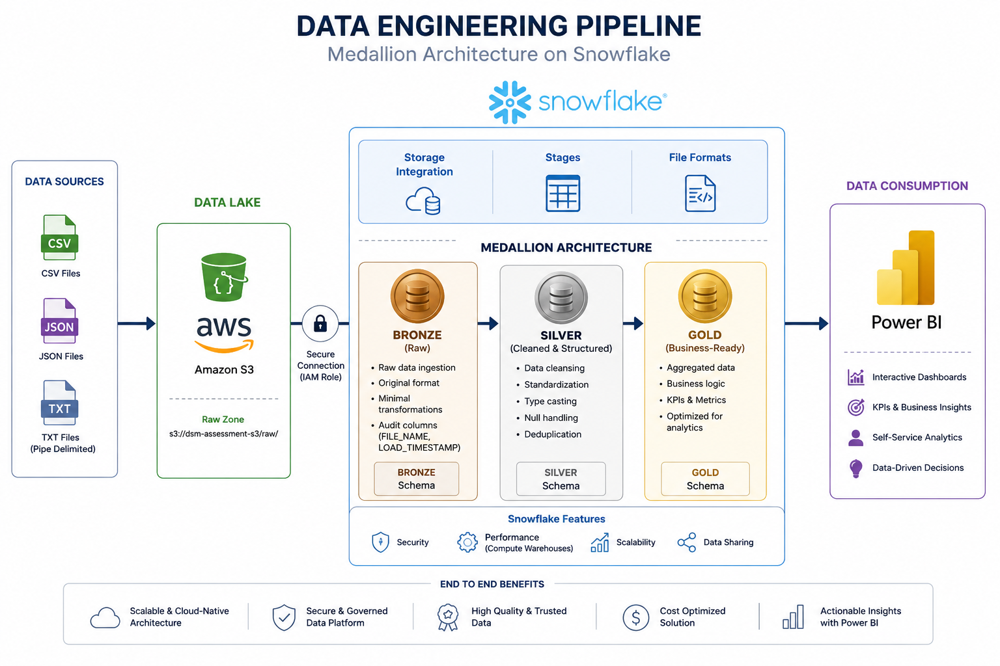

# 🚀 Data Engineering Pipeline on Snowflake (Medallion Architecture)

## 📌 Overview

This project implements an end-to-end data engineering pipeline using **Snowflake** and **AWS S3** as a data lake, following the **Medallion Architecture (Bronze, Silver, Gold)** paradigm. The solution ingests raw data from S3, processes and transforms it through multiple layers, and prepares it for analytical consumption.

🎯 **Objective:** Showcase best practices in **data ingestion, transformation, governance, and cost optimization** within a modern cloud data platform.

---

## 🏗️ Architecture

### 🥉🥈🥇 Medallion Architecture

The pipeline is structured using the Medallion Architecture, organizing data into progressively refined layers:

#### 🥉 Bronze Layer (Raw Data)

- Stores raw data directly from the data lake
- Preserves original structure and format
- Minimal transformations applied
- Includes audit columns:
  - `FILE_NAME`
  - `LOAD_TIMESTAMP`

#### 🥈 Silver Layer (Cleaned & Structured Data)

- Data cleansing and normalization
- Type casting and schema enforcement
- Null handling and standardization
- Provides reliable, query-ready datasets

#### 🥇 Gold Layer (Business-Level Data)

- Aggregated and business-ready datasets
- Optimized for analytics and reporting
- Supports BI and data science use cases

---

### 🧩 Additional Schemas

#### ⚙️ Staging Schema

- Used for intermediate transformations
- Configured as **TRANSIENT** (no Fail-safe)
- 💰 Reduces storage costs

#### 🛠️ Utils Schema

- Stores reusable components:
  - File formats
  - Utility objects

---

## 🌊 Data Lake

### ☁️ AWS S3 Integration

The pipeline leverages **Amazon S3** as the data lake for raw data storage.

#### 🔑 Key Components

- **Storage Integration**
  - Secure connection using IAM roles

- **External Stage**
  - Points to: `s3://dsm-assessment-s3/raw/`
  - Enables direct ingestion and querying

#### 📂 Supported File Types

- CSV 📄
- TXT (pipe-delimited) 📑
- JSON 🧾

---

## 📥 Data Ingestion

### 🧾 File Formats

Custom file formats are defined for flexibility:

- **CSV Format**
  - Comma-delimited
  - Header skipping
  - Null handling

- **TXT Format**
  - Pipe (`|`) delimiter

- **JSON Format**
  - Supports semi-structured data
  - Enables array flattening

---

### ⚡ Loading Strategy

Data ingestion into the **Bronze layer** includes:

- File discovery via stage listing 🔍
- Schema-on-write approach 📐
- Metadata tracking for auditability 🧠

---

## 🧱 Data Modeling

### 🥉 Bronze Layer

- Raw ingestion tables (e.g., `RAW_CLIENTES`)
- Minimal validation
- Metadata included for traceability

---

### 🥈 Silver Layer

- Data cleaning and transformation
- Standardized schemas
- Improved data quality

🔧 Common transformations:

- Type casting (e.g., string → date)
- Null handling
- Deduplication
- Data normalization

---

### 🥇 Gold Layer

- Aggregated and business-level datasets
- Business logic applied
- Optimized for analytics

📊 Example use cases:

- Customer segmentation
- KPI calculations
- Reporting-ready tables

---

## ⚙️ Performance & Cost Optimization

- 💰 **Transient Schemas**
  - Reduce storage costs (no Fail-safe)

- ⚡ **Warehouse Configuration**
  - Uses an **X-Small warehouse** for efficiency

- 🔄 **Layer Separation**
  - Minimizes redundant processing

---

## 🔐 Security

- 🛡️ **IAM Role-Based Access**
  - Secure Snowflake ↔ S3 integration

- 🔑 **Storage Integration**
  - Eliminates hardcoded credentials

---

## 📊 Business Intelligence Consumption (Power BI)

The final objective of this data pipeline is to enable efficient and scalable data consumption for **business intelligence reporting in Power BI**.

### 🎯 Purpose

- Provide **clean, curated, and business-ready datasets** from the Gold layer
- Support **interactive dashboards and analytical reports**
- Ensure **data consistency and reliability** for decision-making

### 🔗 Integration with Power BI

- The **Gold layer tables** are designed as the primary data source for Power BI
- Optimized schemas improve query performance and reduce latency
- Data models can be directly connected via:
  - Snowflake connector in Power BI
  - Import or DirectQuery mode depending on use case

### 📈 Expected Outcomes

- Creation of **dynamic dashboards** for business insights
- Monitoring of **KPIs and performance metrics**
- Empowering stakeholders with **self-service analytics**

This integration ensures that the data engineering pipeline not only processes data efficiently but also delivers tangible value through actionable insights in Power BI.

---

## 🌟 Key Features

- 📈 Scalable cloud-native architecture
- 🧩 Clear separation of data layers
- 🔄 Supports structured & semi-structured data
- 💸 Cost-efficient design
- 🕵️ Auditability and traceability
- ♻️ Modular and reusable components

---

## 🧰 Technologies Used

- ❄️ Snowflake
- ☁️ AWS S3
- 🧮 SQL (Snowflake dialect)

---

## ▶️ How to Run

1. Configure AWS IAM Role and S3 bucket ☁️
2. Create Snowflake Storage Integration 🔗
3. Set up database and schemas 🗄️
4. Create stages and file formats 📂
5. Load data into Bronze tables 🥉
6. Execute transformations for Silver and Gold layers 🥈🥇

---

## 🔮 Future Improvements

- ⏱️ Automate pipelines using Snowflake Tasks & Streams
- ✅ Implement data quality validation frameworks
- 🔗 Integrate orchestration tools (e.g., Airflow)
- ⚡ Enable real-time ingestion
- 📡 Add monitoring and alerting

---

## 📌 Conclusion

This project demonstrates a robust implementation of a **modern data platform** using Snowflake and AWS S3. By leveraging the Medallion Architecture, it ensures scalability, maintainability, and high-quality data processing pipelines suitable for enterprise analytics workloads.

✨ A solid foundation for building production-grade data ecosystems.
